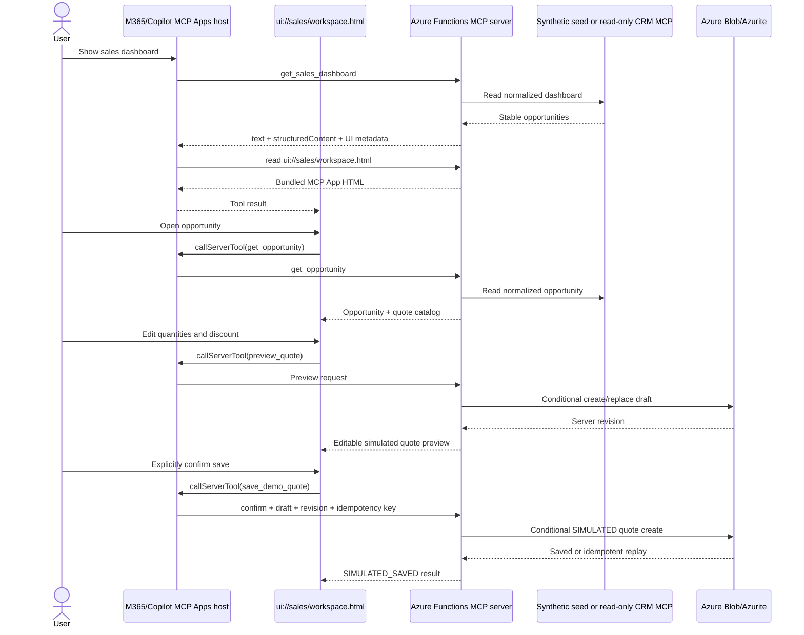

# Sales companion PoC implementation

## Architecture

- **Microsoft 365 declarative agent:** `appPackage` pins five tools through a `RemoteMCPServer` plugin.
- **Azure Functions Remote MCP server:** `src/index.ts` preserves the template entry point and MCP extension registration model.
- **MCP Apps UI:** one Vite single-file bundle is served at `ui://sales/workspace.html` with `text/html;profile=mcp-app`.
- **Sales reads:** `DATA_MODE=synthetic` uses stable deterministic seed data. `DATA_MODE=mcp` uses the official MCP TypeScript client and Streamable HTTP transport against the server-side `CRM_MCP_URI`.
- **Quote domain:** integer cents, integer basis points, input bounds, server-issued draft IDs, optimistic revisions, explicit confirmation, and idempotent save.
- **Persistence:** the existing template storage account is reused. Local development uses the Azurite connection string; Azure uses the existing user-assigned managed identity and Blob endpoint settings.
- **Identity scope:** a trusted Entra principal ID is hashed for Blob paths when available. A clearly labelled PoC fallback is used when local/anonymous host metadata has no identity.

No React, database, APIM, Durable Functions, external agent framework, real CRM write path, or broad CRUD platform is included.

## Sequence



## Exact local demo steps

1. Start Azurite on ports 10000, 10001, and 10002.
2. Run:

   ```powershell
   Set-Location <path-to-clone>
   npm install
   npm test
   npm start
   ```

3. Connect an MCP Apps-capable host to `http://localhost:7071/runtime/webhooks/mcp`.
4. Invoke `get_sales_dashboard`.
5. In the inline UI, select **Open** for Northwind Traders.
6. Keep product quantity `2`, service quantity `1`, and discount `10%`.
7. Select **Preview simulated quote**.
8. Verify subtotal `$330.00`, discount `$33.00`, and total `$297.00`.
9. Select **Edit quote**, change a value, and preview again. Verify the same draft ID has a higher server revision.
10. Select the explicit SIMULATED-save checkbox.
11. Select **Save SIMULATED quote**.
12. Select **Reload saved quote** and verify it reads from Blob storage.

## Azure deployment flow

The parent workflow performs validation and deployment; this implementation does not.

1. Run `azure-validate`/Bicep validation against the existing AZD project.
2. Create/select the approved `azd` environment and configure `PRE_AUTHORIZED_CLIENT_IDS`, `VNET_ENABLED`, location, and service-management reference.
3. Run `azd provision`.
4. Run `azd deploy`.
5. The deployed MCP endpoint is:

   ```text
   https://<function-app-name>.azurewebsites.net/runtime/webhooks/mcp
   ```

6. Confirm Easy Auth returns 401 without a token and accepts an approved Entra client token.
7. Confirm the function identity can create/read/update blobs in `sales-quotes`.
8. If remote read mode is required, set `DATA_MODE=mcp` and `CRM_MCP_URI` through the approved server-side configuration process and test explicit upstream failures.

The IaC preserves Node 22 Flex Consumption, managed identity, Entra configuration, private-network option, disabled storage shared-key access, TLS requirements, AZD layout, and the MCP extension bundle.

## Microsoft 365 sideload

Target-tenant configuration:

1. Set `MCP_SERVER_URL` to the deployed `/runtime/webhooks/mcp` endpoint.
2. Set `MCP_DA_OAUTH_CLIENT_ID` to the Entra application client ID accepted by Function Easy Auth.
3. Set the publisher email, website, privacy, and terms values used by `appPackage`.
4. Run the Agents Toolkit provisioning flow in `m365agents.yml`; it creates the Teams app and Enterprise token-store references.
5. Confirm the generated Application ID URI, OAuth redirect, pre-authorized client, and Easy Auth audiences are correct for the target tenant.
6. Validate the package and sideload it in personal scope.

Open the installed agent in an authenticated Microsoft 365 Copilot session, complete interactive consent, then confirm the five tools, inline MCP App rendering, callback, and trusted per-user identity.

## Dashboard visualization component

The existing MCP Apps dashboard now renders two read-only visualizations without adding a charting dependency: a horizontal pipeline bar chart by opportunity and a donut chart grouped by sales stage. Both are derived entirely from the validated `get_sales_dashboard` payload, retain the detailed accessible table, support dark mode and responsive layouts, and never initiate a write.

Client-side filter controls (stage, free-text account/opportunity search, minimum amount, and sort order) re-derive the KPI cards, both charts, and the table from the already-fetched payload. Filtering issues no extra tool call and cannot change server state, so the read-only guarantee is unchanged. A live summary states how many of the returned opportunities are visible and that the totals reflect the current filter.

### Host rendering requirement

A pinned `mcp_tool_description` file overrides host-side tool discovery, so the M365 host only mounts the widget if each pinned tool itself declares the UI binding. Every tool in `appPackage/mcp-tools.json` therefore carries:

```json
"_meta": { "ui": { "resourceUri": "ui://sales/workspace.html", "visibility": ["model"] } }
```

Without this the tool still executes and returns correct `structuredContent`, but Copilot renders a model-written markdown summary instead of the widget. The Function App also allows the Copilot widget-renderer origin `https://89cdf6cd6b5092741ca01f84e1c6f0112aa59f12da563228720f23ea4abcd810.widget-renderer.usercontent.microsoft.com` through CORS, per the documented MCP server requirements.

```yaml
component:
  name: SalesPipelineCharts
  host_ui: Sales companion MCP Apps dashboard
  mount_point: inline dashboard panel
  trigger: successful get_sales_dashboard result
interaction:
  mode: suggest
  human_control: charts summarize; the opportunity table remains the drill-down control
  autonomy: A0
  fallback: retain KPI cards and the accessible opportunity table when chart data is empty or unavailable
data:
  reads:
    - get_sales_dashboard (read): amounts, probabilities, stages, and stable opportunity IDs
  actions: []
guardrails:
  - render text with safe DOM APIs only
  - derive totals from server-validated values
  - preserve accessible non-visual equivalents
telemetry:
  emits_event_per: existing dashboard tool invocation
  kpi_targeted: time to identify pipeline concentration and stage mix
```

| Condition | Chart behavior | Human path |
| --- | --- | --- |
| Valid opportunities | Render bars and stage donut from server amounts. | Inspect table or open an opportunity. |
| Empty list | Render no segments/bars; keep the explicit empty-table message. | Refresh or inspect provenance. |
| Tool/schema error | Do not invent chart data; show the existing error status. | Retry dashboard or escalate the upstream MCP configuration. |
| Small screen/dark theme | Reflow chart cards and use theme-safe labels/backgrounds. | Same table and buttons remain available. |

The implementation adds no new write adapter or autonomous action, so quote confirmation, identity scoping, and simulation guardrails are unchanged.

## Copilot Cowork skills and diagrams

The `cowork/` package adds three skills over the same MCP contract: pipeline review, opportunity research, and simulated quote review. The workflow structure follows the public L2Q Cowork pattern—trigger phrases, inputs, explicit tool workflow, output shape, references, and guardrails—without copying L2Q code, assets, Salesforce assumptions, or live-write behavior. `cowork/tools/server-tools.json` pins the same schemas used by the declarative agent.

Cowork is a separate host surface. The skills can orchestrate the MCP server, while the existing MCP Apps resource may render inline if the target Cowork tenant supports the documented resource/bridge contract. Cowork's host-specific limits and confirmation behavior must be tested independently; the skills do not weaken the simulated-save approval gate.

Editable architecture artifacts are in `docs/architecture/`:

- `sales-companion-architecture.drawio` — Azure deployment and component-level pages.
- `sales-companion-architecture.png` and `sales-companion-components.png` — reviewed visual previews.
- `sequence.mmd` — Mermaid dashboard, widget callback, quote preview, and confirmed simulated-save sequence.
- `CREDITS.md` — source and asset credits.

The diagrams show the sandboxed MCP Apps UI boundary, Entra/Easy Auth, the Function App tool/resource boundary, managed identity to Blob, Application Insights, synthetic data, and the optional configured upstream MCP boundary.

## Copilot Studio feasibility spike

1. Create a test agent in an approved Copilot Studio environment.
2. Add the deployed MCP server through the MCP connector/tool experience.
3. Configure Entra authentication without embedding a secret in the project.
4. Enable only the five PoC tools.
5. Run the dashboard-to-save demo.
6. Capture whether MCP Apps UI renders inline or the agent falls back to structured/text output.
7. Inspect the authenticated request at the Function App and verify a stable M365 user principal reaches the identity resolver.

**Pass criteria**

- All five tools are discoverable with their intended schemas.
- `get_sales_dashboard` and `get_opportunity` are treated as read-only.
- The shared UI renders inline, or a documented Studio limitation is confirmed with structured output still usable.
- UI callbacks invoke the exact server tools deterministically.
- `save_demo_quote` cannot succeed without the exact `CONFIRM_SIMULATED_SAVE` token and current revision. A string token is used because live M365 telemetry showed the Azure Functions MCP binding dropping the boolean `confirm` argument.
- A repeated idempotency key returns the same quote.
- Blob records are isolated by a proven authenticated user identity.
- No CRM create/update/delete operation exists or is invoked.

Failure to prove authenticated per-user Blob scoping blocks production progression.

## Battle card

| Topic | PoC position |
| --- | --- |
| User value | Review a pipeline record and safely prepare a quote without leaving the conversational workspace. |
| Differentiator | MCP Apps provides deterministic, accessible inline interaction while the agent retains natural-language orchestration. |
| Safety | Every screen says Simulation - not CRM; the only save is Blob-backed, confirmed, revision-checked, and idempotent. |
| Integration path | Synthetic data proves UX; `DATA_MODE=mcp` proves a fixed read-only CRM MCP contract without exposing endpoint selection to the browser. |
| Azure fit | Reuses the secure Remote MCP Functions template, managed identity, Entra, AZD, and existing storage. |
| Deliberate exclusions | No real CRM writes, database, React, APIM, Durable Functions, or additional LLM/agent framework. |
| Production gate | Prove M365 authenticated identity propagation and tenant auth configuration end to end. |

## Limitations and next gates

- The PoC quote catalog is exactly two fixed items per opportunity.
- The remote CRM MCP contract supports only dashboard and opportunity reads.
- Remote upstream OAuth is not implemented; the configured MCP endpoint must support the deployment's approved server-to-server access model.
- Identity metadata varies by host. The current resolver intentionally falls back and labels the result when no trusted principal ID is exposed.
- Blob container creation is attempted locally for Azurite; Azure provisioning also declares the container.
- Currency is fixed to USD.
- There is no tax, legal approval, PDF generation, CRM synchronization, or production audit workflow.
- M365 app publisher metadata remains tenant-owned placeholder content.

The sample includes Entra SSO, Easy Auth, managed-identity Blob access, package
templates, and personal-scope sideload instructions. Each deployment must still
verify interactive consent, inline rendering, callbacks, and per-user identity
isolation in its target tenant.

## Cleanup

Run `azd down` only when the sample's Azure resources should be deleted. Remove
the sideloaded Microsoft 365 package separately through the tenant's approved
application-management flow.
