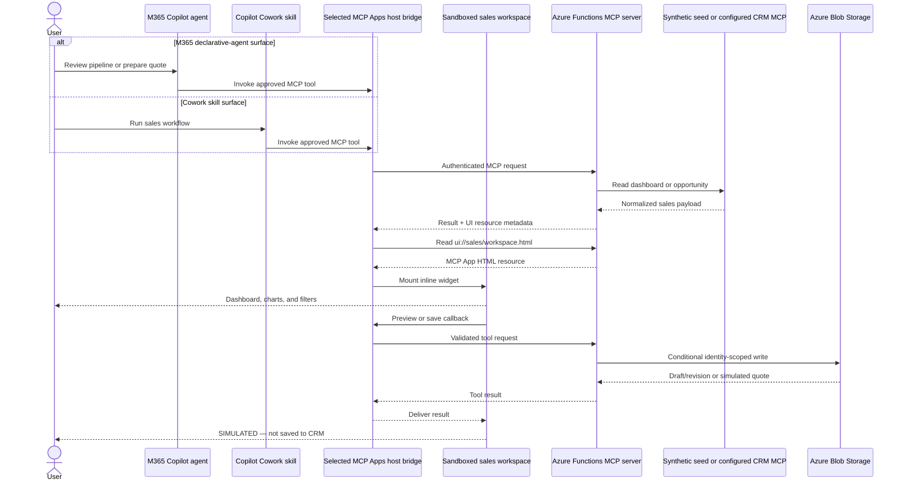

# Sales Companion for Copilot Cowork

This package adds Cowork-compatible Agent Skills on top of the deployed Sales Companion MCP server. It follows the L2Q pattern: lean `SKILL.md` workflows orchestrate connector tools and leave document/email/calendar creation to Cowork's built-in skills.

## Included skills

| Skill | Purpose | MCP tools | Writes |
|---|---|---|---|
| `pipeline-review-pack` | Reconcile pipeline data, then prepare an Excel workbook, PowerPoint narrative, and executive email draft | `get_sales_dashboard`, `get_opportunity` | Cowork artifacts only; no send |
| `opportunity-research-brief` | Prepare a grounded Word meeting brief and optional email draft | `get_sales_dashboard`, `get_opportunity` | Cowork artifacts only; no send |
| `simulated-quote-review` | Build, revise, review, and explicitly confirm a simulated quote; optionally produce a Word review | `get_opportunity`, `preview_quote`, `save_demo_quote`, `get_demo_quote` | Blob-backed simulation only |

All outputs must label synthetic data and simulated saves. No skill can write to CRM, send email, schedule meetings, or claim a production quote was saved.

## Setup

1. Replace `REPLACE_WITH_MCP_URI` in `manifest.json` with the approved MCP endpoint.
2. Replace `REPLACE_WITH_COWORK_AUTH_REFERENCE` with the host-supported OAuth/token-store reference; never place credentials in this folder.
3. Run `scripts/package.ps1`. It validates required files, icons, and skill-folder/frontmatter name parity before creating the ZIP.
4. Upload through the approved Cowork custom-app flow.
5. Open Cowork's Sources & Skills view and verify the connector and three skills are listed.

The skills are portable Agent Skills documents and can also be inspected by other compatible agent runtimes. They orchestrate Cowork's built-in Word, Excel, PowerPoint, and email-drafting capabilities rather than reimplementing those surfaces. Sending email, scheduling meetings, and any external write remain separate consequential actions requiring explicit approval.

## Safety model

- Read tools advertise `readOnlyHint`; the selected M365/Cowork host still controls connector consent and confirmation prompts.
- Quote preview creates only a user-scoped demo draft.
- `save_demo_quote` is side-effecting and requires the exact `CONFIRM_SIMULATED_SAVE` token, current revision, and idempotency key.
- Review the draft before any simulated save. Never weaken the token or describe simulation storage as CRM persistence.

## Runtime sequence

The full save-confirmation sequence is maintained in [`../docs/architecture/sequence.mmd`](../docs/architecture/sequence.mmd).

## Reference

The package is inspired by the structure and workflow style of [L2Q Cowork at `7f5c968`](https://github.com/scadam/L2Q/tree/7f5c968b12d81e3a6eca0277a0e91ca59ecbe484/cowork), but contains original sales workflows and no copied L2Q source or assets. The MCP contract is defined by this repository's `appPackage/mcp-tools.json`.
