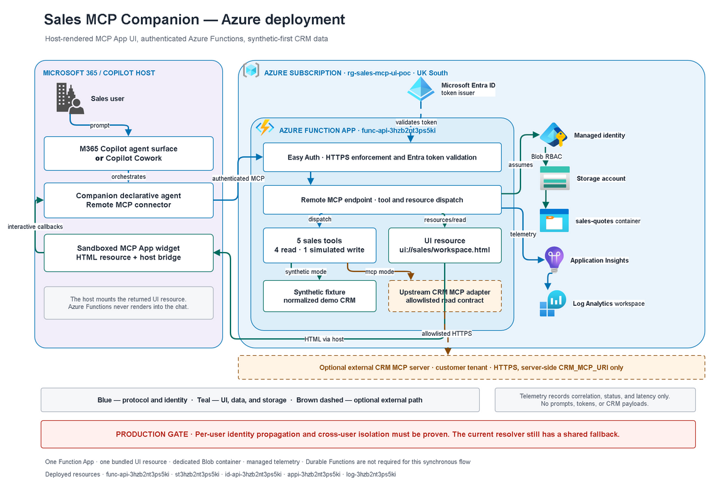
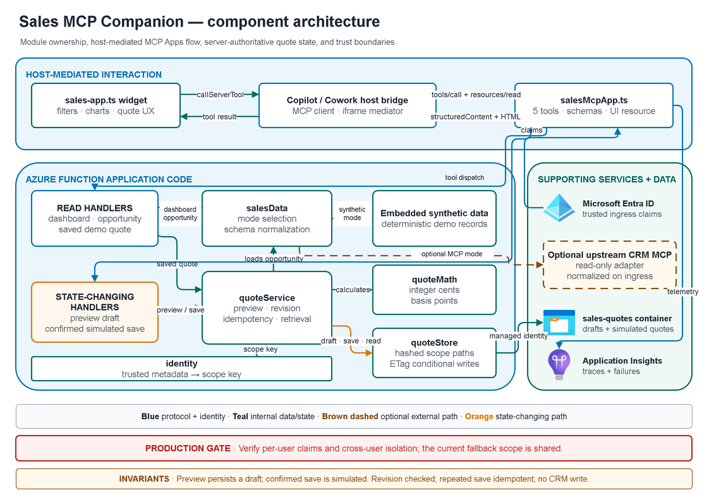

# Architecture diagrams

## Final diagrams

### Azure deployment

### Component architecture

The editable `sales-companion-architecture.drawio` contains both pages and is the authoritative source. Only the final pass is retained; intermediate pitch and per-pass artifacts were deliberately removed.

Azure services are drawn with the official Azure architecture icon set. Code modules, host surfaces, and non-Azure elements stay as labelled boxes.

## Supporting artifacts

- `sequence.mmd` — host-mediated Mermaid sequence for M365 or Cowork, widget callbacks, preview, and confirmed simulated save.
- `ITERATE-REVIEW.md` — review record and retention note.
- `CREDITS.md` — provenance, tooling, and asset statement.

The deployment diagram distinguishes Entra token issuance from Function App Easy Auth enforcement and Function managed identity. The component diagram is responsibility-first: it separates host-mediated MCP Apps interaction, read handlers, quote orchestration, identity-scoped state, embedded demo data, and optional upstream CRM reads. Brown dashed paths are optional; quote persistence is simulation-only. The red identity note is a production gate, not a claim that per-user isolation has already been proven.
